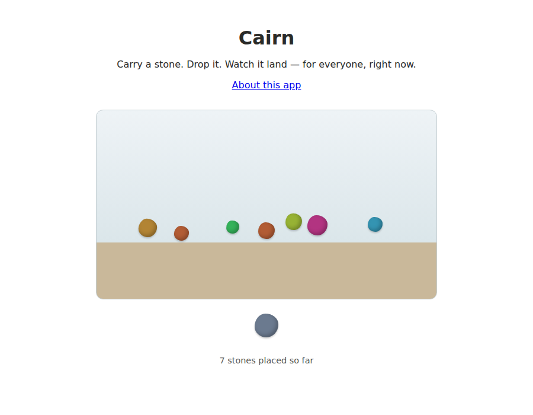

# Cairn

Cairn is one shared pile of stones. Open it, drag the stone at the bottom onto
the pile, and watch it land — for you, and for everyone else looking at the
same page, at the same moment. There are no accounts, no rooms, no score.
Just a cairn that a room full of people can build together, one stone at a
time, and that's still there tomorrow.

## What "good" means here

Good means the three things the brief actually asks for are true, and checked,
not just claimed: a stone someone drops is visible on every other open session
within about a second, with nobody reloading anything; what gets dropped
survives a restart or a redeploy, not just the current tab; and two visitors
can tell their stones apart from each other without either of them signing up
for anything. `spec/invariants.test.ts` and `spec/cairn.test.ts` enforce the
checkable parts of that directly against the running app — real-time
broadcast, cross-session persistence, and rejection of malformed input are all
exercised over the actual `/ws` protocol, not mocked. Whether the *interaction*
is actually good — whether dropping a stone feels satisfying, whether watching
someone else's stone land reads as "someone's here" rather than as a
notification — isn't something a test can decide. I judged that by using it
myself from two browser windows side by side and asking whether I noticed the
other one without it announcing itself.

## What I read while deciding

Robin Sloan's [*An App Can Be a Home-Cooked
Meal*](https://www.robinsloan.com/notes/home-cooked-app/) argues for sizing
software to its real audience instead of defaulting to "professional,
scalable" infrastructure. Cairn's audience is a crit room, and the brief's
single 256MB machine agrees with that framing: one Node process, one SQLite
file, no accounts, nothing extra to operate.

Ink & Switch's [*Local-first
software*](https://www.inkandswitch.com/essay/local-first/) makes a real case
for CRDTs and offline-capable apps that outlive any one server. I read it and
didn't follow it: Cairn only ever appends a new stone to a shared pile, which
never conflicts, so a single authoritative server is simpler than a merge
algorithm for a problem this app doesn't have. That's a trade-off I'm naming,
not one I missed.

Dourish & Bellotti's *Awareness and Coordination in Shared Workspaces* (CSCW
'92) is why there's no visitor list, no names, no "X is online" banner. They
found that awareness picked up passively through a shared object — rather than
announced separately from it — lets people move fluidly between paying close
attention and barely noticing each other. A colored stone landing *is* the
presence signal here; see `docs/adr/0002-visitor-identity.md`.

## What I chose not to build

No moderation, no way to remove a stone, no multiple rooms, no cap on how
large the pile can grow, no chosen names. Each is a real, small feature; none
of them were needed to make the three required properties true, and each would
have added a decision — who moderates, what happens once the pile is "too big"
— that nothing here asked me to make yet. `docs/adr/` has the reasoning behind
the two decisions that mattered most: the stack, and what counts as a visitor.

